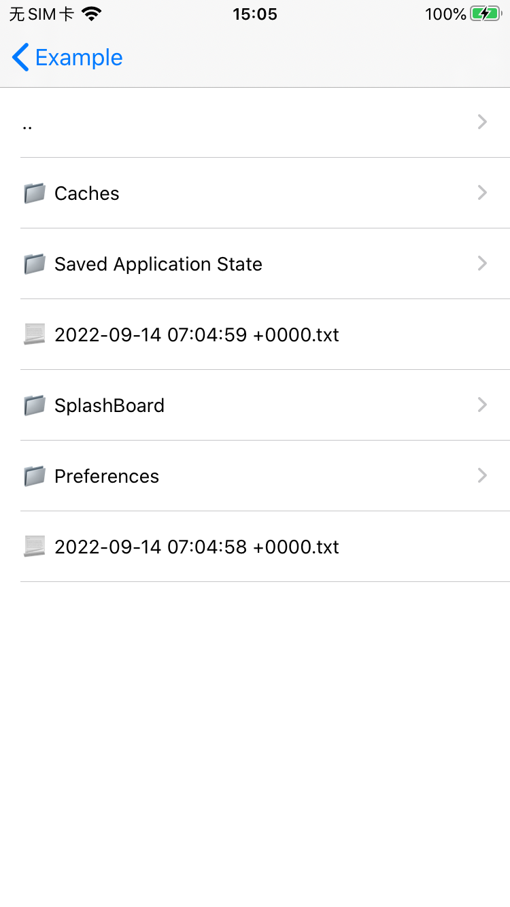
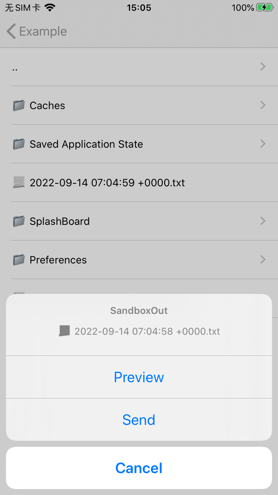

# SandboxOut

Quickly browse the iOS sandbox data in the App and perform operations.

# Usage

## import file

```
#import "SandboxOut.h"
#import "SOViewController.h"
```

## Default file path

```
SOViewController *viewController = [[SOViewController alloc] init];
[self.navigationController pushViewController:viewController animated:YES];
```

## Custom file path

```
SandboxOut *sandboxOut = [[SandboxOut alloc] initWithRootPath:@"your custom files path"];
SOViewController *viewController = [[SOViewController alloc] init];
viewController.sandboxOut = sandboxOut;
[self.navigationController pushViewController:viewController animated:YES];
```

# Demo



